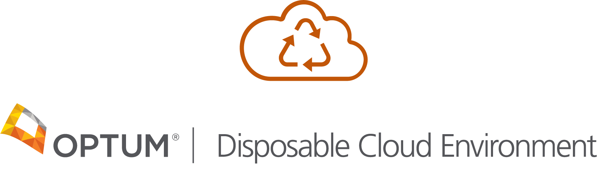

# Disposable Cloud Environment (DCE)

> **DCE is your playground in the cloud**

Disposable Cloud Environment (DCE) manages ephemeral AWS accounts for easy and secure access to the cloud. 

DCE users can "lease" an AWS account for a defined period of time and with a limited budget. 

At the end of the lease, or if the lease's budget is reached, the account is wiped clean and returned to the account pool so it may be leased again.

## Getting Started & Documentation

Deploy your own Disposable Cloud Environment by following our [quick start guide](./docs/quickstart.md), available on our documentation website:

[dce.readthedocs.io](./docs/index.md)

## DCE CLI

The easiest way to get started with DCE is with the DCE CLI tool:

[github.com/Optum/dce-cli](https://github.com/Optum/dce-cli)

```bash
# Deploy DCE
dce system deploy

# Add an account to the pool
dce accounts add \
    --account-id 123456789012 \
    --admin-role-arn arn:aws:iam::123456789012:role/OrganizationAccountAccessRole

# Lease an account
dce leases create

# Login to your account
dce leases login
```

## Contributing to DCE

DCE was born at Optum, but belongs to the community. Improve your cloud experience and [open a PR](https://github.com/Optum/dce/pulls).

[Contributor Guidelines](./CONTRIBUTING.md)


## License

[Apache License v2.0](./LICENSE)