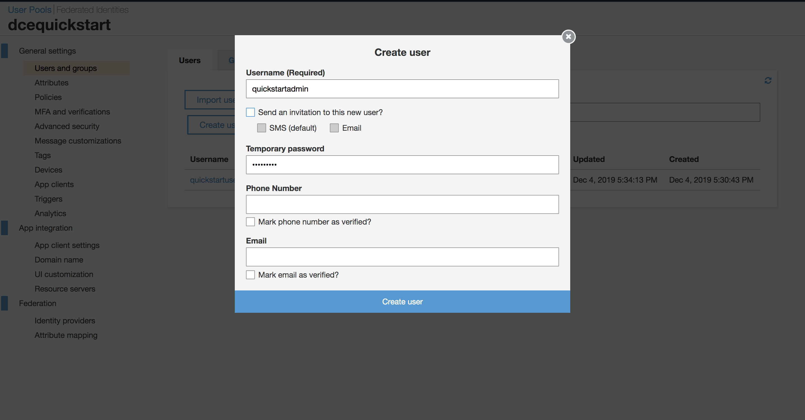

# API Auth

There are two ways to authenticate against the DCE APIs:

1. `AWS Cognito <#using-aws-cognito>`_
1. `IAM credentials <#using-iam-credentials>`_

## Roles

Note: The enforcement of roles is currently a `work in progress <https://github.com/Optum/dce/issues/137>`_.

### Admins

Admins have full access to all APIs and will not get back filtered results when querying APIs.

There are three different ways a user is considered an admin:

1. They have an IAM user/role/etc with a policy that gives them access to the API
1. A Cognito user is placed into a Cognito group called `Admins`
1. A Cognito user has an attribute in `custom:roles` that will match a search criteria specified by the Terraform variable `cognito_roles_attribute_admin_name`

### Users

Users (by default) are given access to the leasing and usage APIs.  This is done so they can request their own lease and look at the usage of their leases.  Any user authenticated through Cognito will automatically fall into the `Users` role unless designated as an Admin.

## Using AWS Cognito

AWS Cognito is used to authenticate and authorize DCE users. This section will walk through setting this
up in the AWS web console, but note that all of these operations can be automated using the AWS CLI or SDKs. While
this example uses Cognito User Pools to create and manage users, you may also [integrate Cognito with your own IdP](https://docs.aws.amazon.com/cognito/latest/developerguide/cognito-user-pools-identity-provider.html).


### Configuring Cognito

1. Open the AWS Console in your DCE Master Account and Navigate to AWS Cognito by typing `Cognito` in the search bar

    

1. Select `Manage User Pools` and click on the dce user pool.

    

1. Select `Users and groups`

    

1. Create a user

    

1. Name the user and provide a temporary password. You may uncheck all of the boxes and leave the other fields blank. This user will not have admin priviliges.

    

1. Create a second user to serve as a system admin. Follow the same steps as you did for creating the first user, but name this one something appropriate for their role as an administrator.

    

1. Create a group

    

1. Users in this group will be granted admin access to DCE. The group name must contain the term `Admin`. Choose a name and click on the `Create group` button.

    

1. Add your admin user to the admin group to grant them admin privileges.
    
    

1. Type `dce auth` in your command terminal. This will open a browser with a log in screen. Enter the username and password for the non-admin user that you created. Reset the password as prompted.

    

1. Upon successfully logging in, you will be redirected to a credentials page containing a temporary authentication code. Click the button to copy the auth code to your clipboard.

    

1. Return to your command terminal and paste the auth code into the prompt.

    ```
    dce auth
    ✔ Enter API Token: : █
    ```

1. You are now authenticated as a DCE User. Test that you have proper authorization by typing `dce leases list`.
This will return an empty list indicating that there are currently no leases which you can view.
If you are not properly authenticated as a user, you will see a permissions error.

    ```
    dce leases list
    []
    ```

1. Users are not authorized to list child accounts in the accounts pool. Type `dce accounts list` to verify that you get a permissions error when trying to
view information you do not have access to.

    ```
    dce accounts list
    err:  [GET /accounts][403] getAccountsForbidden
    ```

## Using IAM Credentials

The DCE API accepts authentication via IAM credentials using [SigV4 signed requests](https://docs.aws.amazon.com/general/latest/gr/sigv4_signing.html). 

At minumum, the IAM credentials used to access DCE must have an attached policy that grants permission to invoke the DCE API Gateway methods, e.g.

```
{
  "Version": "2012-10-17",
  "Statement": [
    {
      "Effect": "Allow",
      "Action": [
        "execute-api:Invoke"
      ],
      "Resource": [
        "<DCE API Gateway ARN>"
      ]
    }
  ]
}
JSON
}
```

This policy is accessible via the `api_access_policy_name` and `api_access_policy_arn` `terraform outputs <./terraform.html#accessing-terraform-outputs>`_.

Any requests made with IAM credentials that have sufficient permissions to invoke the DCE API, but which are not associated with a Congito User Pool User, will be treated as an `admin role <#admins>`_.

The process for signing requests with SigV4 is somewhat involved, but luckily there are a number of tools to make this easier. For example:

- [AWS Golang SDK signer/v4 package](https://docs.aws.amazon.com/sdk-for-go/api/aws/signer/v4/)
- [aws-requests-auth](https://github.com/DavidMuller/aws-requests-auth) for Python
- [Postman AWS Signature authentication](https://docs.aws.amazon.com/apigateway/latest/developerguide/how-to-use-postman-to-call-api.html)

AWS also provides [examples for a number of languages in their docs](https://docs.aws.amazon.com/general/latest/gr/signature-v4-examples.html).

See `DCE CLI Credentials <./howto.html#configuring-aws-credentials>`_ to configure IAM credentials for the DCE CLI.